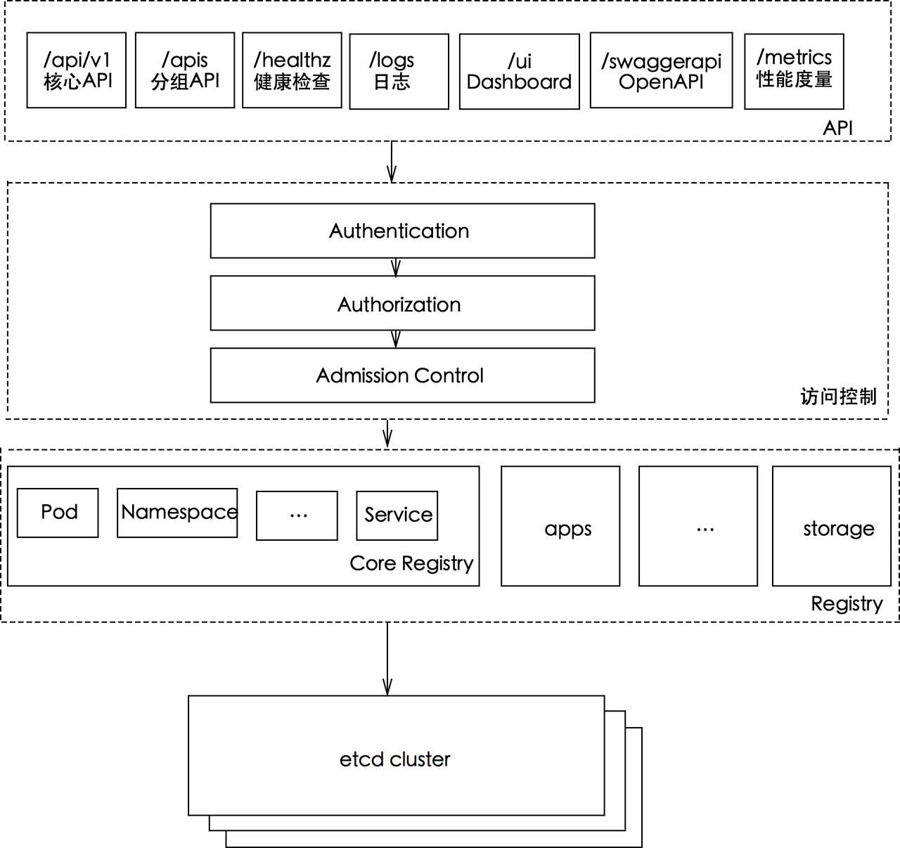

# 【k8s源码阅读】 kube-apiserver 认证 授权

>  源码地址：git@github.com:kubernetes/kubernetes.git
> version: 1.21.3

### 简单回顾



从apiserver访问流程看，kube-apiserver作为kubernetes集群请求入口，接收客户端以及组件的请求，每一个请求都需要经过访问控制层Authentication(认证)，Authorization(授权)、Admission controller(准入控制)才能真正操作kubernetes资源。


## 1. Authentication

kube-apiserver在1.21这个版本里有8种认证方式，分别是ClientCA、TokenAuth、BootstrapToken、RequestHeader、ServiceAccounts、Anonymous、WebHookAuth、OIDC。每一种认证被实例化之后成为`Authenticator`（认证器）。

每一种认证都会封装在http.Handler请求处理函数里，接收组件或者客户端的请求并进行认证。

源码中是先对认证信息进行声明以及初始化配置，之后通过config.new进行实例化认证器。

```shell
// 代码路径： cmd/kube-apiserver/app/server.go
NewAPIServerCommand
// 初始化参数，创建对应认证方式实例
--> options.NewServerRunOptions()
    --> kubeoptions.NewBuiltInAuthenticationOptions().WithAll()
        --> WithAnonymous().
		    --> WithBootstrapToken().
		    --> WithClientCert().
		    --> WithOIDC().
		    --> WithRequestHeader().
		    --> WithServiceAccounts().
		    --> WithTokenFile().
		    --> WithWebHook()
```

在CreateServerChain创建服务链时，CreateKubeAPIServerConfig里会封装每一个认证方式，并返回`Authenticator`认证器

```
CreateServerChain
--> CreateKubeAPIServerConfig
    --> buildGenericConfig
        --> s.Authentication.ApplyTo
            --> o.ToAuthenticationConfig()
            --> authenticatorConfig.New()
                --> union.New(authenticators...)
```

调用流程：

```
DefaultBuildHandlerChain
--> genericapifilters.WithAuthentication
    --> withAuthentication
        --> auth.AuthenticateRequest(req)
            --> AuthenticateRequest
```

代码路径：vendor/k8s.io/apiserver/pkg/authentication/request/union/union.go

```go
// AuthenticateRequest authenticates the request using a chain of authenticator.Request objects.
func (authHandler *unionAuthRequestHandler) AuthenticateRequest(req *http.Request) (*authenticator.Response, bool, error) {
	var errlist []error
  // 遍历所有支持的的认证器
	for _, currAuthRequestHandler := range authHandler.Handlers {
		resp, ok, err := currAuthRequestHandler.AuthenticateRequest(req)
		if err != nil {
			if authHandler.FailOnError {
				return resp, ok, err
			}
			errlist = append(errlist, err)
			continue
		}
    
    // 有一个认证通过，即可返回。认证成功
		if ok {
			return resp, ok, err
		}
	}

	return nil, false, utilerrors.NewAggregate(errlist)
}
```

认证配置

代码路径： pkg/kubeapiserver/authenticator/config.go

主要包含认证信息配置以及构建认证器方法

```go
// Config contains the data on how to authenticate a request to the Kube API Server
// 认证请求配置信息
// 这里省略里一些配置
type Config struct {
	Anonymous      bool
	BootstrapToken bool

	TokenAuthFile               string
	OIDCIssuerURL               string
  ...
	ServiceAccountKeyFiles      []string
  ...
	APIAudiences                authenticator.Audiences
	WebhookTokenAuthnConfigFile string
	WebhookTokenAuthnVersion    string
	WebhookTokenAuthnCacheTTL   time.Duration
	// WebhookRetryBackoff specifies the backoff parameters for the authentication webhook retry logic.
	// This allows us to configure the sleep time at each iteration and the maximum number of retries allowed
	// before we fail the webhook call in order to limit the fan out that ensues when the system is degraded.
	WebhookRetryBackoff *wait.Backoff

	TokenSuccessCacheTTL time.Duration
	TokenFailureCacheTTL time.Duration

	RequestHeaderConfig *authenticatorfactory.RequestHeaderConfig

	// TODO, this is the only non-serializable part of the entire config.  Factor it out into a clientconfig
	ServiceAccountTokenGetter   serviceaccount.ServiceAccountTokenGetter
	BootstrapTokenAuthenticator authenticator.Token
	// ClientCAContentProvider are the options for verifying incoming connections using mTLS and directly assigning to users.
	// Generally this is the CA bundle file used to authenticate client certificates
	// If this value is nil, then mutual TLS is disabled.
	ClientCAContentProvider dynamiccertificates.CAContentProvider
	// Optional field, custom dial function used to connect to webhook
	CustomDial utilnet.DialFunc
}
```

返回认证器集合

```go
// New returns an authenticator.Request or an error that supports the standard
// Kubernetes authentication mechanisms.
// 认证器集合
func (config Config) New() (authenticator.Request, *spec.SecurityDefinitions, error) {
	var authenticators []authenticator.Request
	var tokenAuthenticators []authenticator.Token
	securityDefinitions := spec.SecurityDefinitions{}

	// front-proxy, BasicAuth methods, local first, then remote
	// Add the front proxy authenticator if requested
	if config.RequestHeaderConfig != nil {
		requestHeaderAuthenticator := headerrequest.NewDynamicVerifyOptionsSecure(
			config.RequestHeaderConfig.CAContentProvider.VerifyOptions,
      ...
		)
		authenticators = append(authenticators, authenticator.WrapAudienceAgnosticRequest(config.APIAudiences, requestHeaderAuthenticator))
	}

	// X509 methods
	if config.ClientCAContentProvider != nil {
		certAuth := x509.NewDynamic(config.ClientCAContentProvider.VerifyOptions, x509.CommonNameUserConversion)
		authenticators = append(authenticators, certAuth)
	}

	// Bearer token methods, local first, then remote
	if len(config.TokenAuthFile) > 0 {
		tokenAuth, err := newAuthenticatorFromTokenFile(config.TokenAuthFile)
		if err != nil {
			return nil, nil, err
		}
		tokenAuthenticators = append(tokenAuthenticators, authenticator.WrapAudienceAgnosticToken(config.APIAudiences, tokenAuth))
	}
	if len(config.ServiceAccountKeyFiles) > 0 {
		serviceAccountAuth, err := newLegacyServiceAccountAuthenticator(config.ServiceAccountKeyFiles, config.ServiceAccountLookup, config.APIAudiences, config.ServiceAccountTokenGetter)
		if err != nil {
			return nil, nil, err
		}
		tokenAuthenticators = append(tokenAuthenticators, serviceAccountAuth)
	}
	if config.ServiceAccountIssuer != "" {
		serviceAccountAuth, err := newServiceAccountAuthenticator(config.ServiceAccountIssuer, config.ServiceAccountKeyFiles, config.APIAudiences, config.ServiceAccountTokenGetter)
		if err != nil {
			return nil, nil, err
		}
		tokenAuthenticators = append(tokenAuthenticators, serviceAccountAuth)
	}
	if config.BootstrapToken {
		if config.BootstrapTokenAuthenticator != nil {
			// TODO: This can sometimes be nil because of
			tokenAuthenticators = append(tokenAuthenticators, authenticator.WrapAudienceAgnosticToken(config.APIAudiences, config.BootstrapTokenAuthenticator))
		}
	}
	// NOTE(ericchiang): Keep the OpenID Connect after Service Accounts.
	//
	// Because both plugins verify JWTs whichever comes first in the union experiences
	// cache misses for all requests using the other. While the service account plugin
	// simply returns an error, the OpenID Connect plugin may query the provider to
	// update the keys, causing performance hits.
	if len(config.OIDCIssuerURL) > 0 && len(config.OIDCClientID) > 0 {
		oidcAuth, err := newAuthenticatorFromOIDCIssuerURL(oidc.Options{
			IssuerURL:            config.OIDCIssuerURL,
			ClientID:             config.OIDCClientID,
      ...
		})
		if err != nil {
			return nil, nil, err
		}
		tokenAuthenticators = append(tokenAuthenticators, authenticator.WrapAudienceAgnosticToken(config.APIAudiences, oidcAuth))
	}
	if len(config.WebhookTokenAuthnConfigFile) > 0 {
		webhookTokenAuth, err := newWebhookTokenAuthenticator(config)
		if err != nil {
			return nil, nil, err
		}

		tokenAuthenticators = append(tokenAuthenticators, webhookTokenAuth)
	}

	if len(tokenAuthenticators) > 0 {
		// Union the token authenticators
		tokenAuth := tokenunion.New(tokenAuthenticators...)
    ...
	}

	if len(authenticators) == 0 {
		if config.Anonymous {
			return anonymous.NewAuthenticator(), &securityDefinitions, nil
		}
		return nil, &securityDefinitions, nil
	}

	authenticator := union.New(authenticators...)
	authenticator = group.NewAuthenticatedGroupAdder(authenticator)
	if config.Anonymous {
		// If the authenticator chain returns an error, return an error (don't consider a bad bearer token
		// or invalid username/password combination anonymous).
		authenticator = union.NewFailOnError(authenticator, anonymous.NewAuthenticator())
	}
	return authenticator, &securityDefinitions, nil
}
```

代码路径：vendor/k8s.io/apiserver/pkg/authentication/authenticator/interfaces.go

认证器要实现的接口

```go
// Token checks a string value against a backing authentication store and
// returns a Response or an error if the token could not be checked.
type Token interface {
	AuthenticateToken(ctx context.Context, token string) (*Response, bool, error)
}

// Request attempts to extract authentication information from a request and
// returns a Response or an error if the request could not be checked.
type Request interface {
	AuthenticateRequest(req *http.Request) (*Response, bool, error)
}

// Response is the struct returned by authenticator interfaces upon successful
// authentication. It contains information about whether the authenticator
// authenticated the request, information about the context of the
// authentication, and information about the authenticated user.
type Response struct {
	// Audiences is the set of audiences the authenticator was able to validate
	// the token against. If the authenticator is not audience aware, this field
	// will be empty.
	Audiences Audiences
	// User is the UserInfo associated with the authentication context.
	User user.Info
}
```

代码路径：pkg/kubeapiserver/options/authentication.go

```go
// BuiltInAuthenticationOptions contains all build-in authentication options for API Server
type BuiltInAuthenticationOptions struct {
	APIAudiences    []string
	Anonymous       *AnonymousAuthenticationOptions
	BootstrapToken  *BootstrapTokenAuthenticationOptions
	ClientCert      *genericoptions.ClientCertAuthenticationOptions
	OIDC            *OIDCAuthenticationOptions
	RequestHeader   *genericoptions.RequestHeaderAuthenticationOptions
	ServiceAccounts *ServiceAccountAuthenticationOptions
	TokenFile       *TokenFileAuthenticationOptions
	WebHook         *WebHookAuthenticationOptions

	TokenSuccessCacheTTL time.Duration
	TokenFailureCacheTTL time.Duration
}
```

bearer token认证流程：

```go
func (a *Authenticator) AuthenticateRequest(req *http.Request) (*authenticator.Response, bool, error) {
	auth := strings.TrimSpace(req.Header.Get("Authorization"))
	if auth == "" {
		return nil, false, nil
	}
	parts := strings.SplitN(auth, " ", 3)
	if len(parts) < 2 || strings.ToLower(parts[0]) != "bearer" {
		return nil, false, nil
	}

	token := parts[1]

	// Empty bearer tokens aren't valid
	if len(token) == 0 {
		return nil, false, nil
	}

	resp, ok, err := a.auth.AuthenticateToken(req.Context(), token)
	// if we authenticated successfully, go ahead and remove the bearer token so that no one
	// is ever tempted to use it inside of the API server
	if ok {
		req.Header.Del("Authorization")
	}

	// If the token authenticator didn't error, provide a default error
	if !ok && err == nil {
		err = invalidToken
	}

	return resp, ok, err
}
```

## 2. Authorization

在k8s系统组件以及客户端在通过认证阶段之后，会来到授权阶段。kube-apiserve同时支持多种授权机制，并且同时开启多个授权功能。

同样客户端发起一个请求，在经过授权阶段时，只要有一个授权器通过授权，则表示通过授权。

目前kube-apiserver提供了六种授权机制，分别是AlwaysAllow、AlwaysDeny、WebHook、Node、ABAC、RBAC。每一种授权机制在被实例化之后会成为一个`Authorizer`授权器，每一个授权器都封装在http.Handler里，接受请求并进行授权。

```
// 代码路径： cmd/kube-apiserver/app/server.go
--> NewAPIServerCommand
    --> options.NewServerRunOptions()
            // 实例化授权参数
        --> kubeoptions.NewBuiltInAuthorizationOptions()
```

在CreateServerChain创建服务链时，CreateKubeAPIServerConfig里会封装每一个认证方式，并返回`Authorizer`认证器

```
CreateServerChain
--> CreateKubeAPIServerConfig
    --> buildGenericConfig
        --> BuildAuthorizer
            --> s.Authorization.ToAuthorizationConfig
            --> authorizationConfig.New()
                --> union.New(authenticators...)
```

调用流程：

```
DefaultBuildHandlerChain
--> genericapifilters.WithAuthorization
    --> withAuthentication
        --> a.Authorize(ctx, attributes)
            --> Authorize
```

代码路径： vendor/k8s.io/apiserver/pkg/authorization/union/union.go

```go
// Authorizes against a chain of authorizer.Authorizer objects and returns nil if successful and returns error if unsuccessful
func (authzHandler unionAuthzHandler) Authorize(ctx context.Context, a authorizer.Attributes) (authorizer.Decision, string, error) {
	var (
		errlist    []error
		reasonlist []string
	)
  // 遍历授权器
	for _, currAuthzHandler := range authzHandler {
		decision, reason, err := currAuthzHandler.Authorize(ctx, a)

		if err != nil {
			errlist = append(errlist, err)
		}
		if len(reason) != 0 {
			reasonlist = append(reasonlist, reason)
		}
		switch decision {
    // 通过授权返回
		case authorizer.DecisionAllow, authorizer.DecisionDeny:
			return decision, reason, err
		case authorizer.DecisionNoOpinion:
			// continue to the next authorizer
		}
	}
  
	return authorizer.DecisionNoOpinion, strings.Join(reasonlist, "\n"), utilerrors.NewAggregate(errlist)
}
```

代码路径：pkg/kubeapiserver/authorizer/config.go

```go
// Config contains the data on how to authorize a request to the Kube API Server
type Config struct {
	AuthorizationModes []string

	// Options for ModeABAC

	// Path to an ABAC policy file.
	PolicyFile string

	// Options for ModeWebhook

	// Kubeconfig file for Webhook authorization plugin.
	WebhookConfigFile string
	// API version of subject access reviews to send to the webhook (e.g. "v1", "v1beta1")
	WebhookVersion string
	// TTL for caching of authorized responses from the webhook server.
	WebhookCacheAuthorizedTTL time.Duration
	// TTL for caching of unauthorized responses from the webhook server.
	WebhookCacheUnauthorizedTTL time.Duration
	// WebhookRetryBackoff specifies the backoff parameters for the authorization webhook retry logic.
	// This allows us to configure the sleep time at each iteration and the maximum number of retries allowed
	// before we fail the webhook call in order to limit the fan out that ensues when the system is degraded.
	WebhookRetryBackoff *wait.Backoff

	VersionedInformerFactory versionedinformers.SharedInformerFactory

	// Optional field, custom dial function used to connect to webhook
	CustomDial utilnet.DialFunc
}
```

```go
// New returns the right sort of union of multiple authorizer.Authorizer objects
// based on the authorizationMode or an error.
// 返回授权器集合
func (config Config) New() (authorizer.Authorizer, authorizer.RuleResolver, error) {
	if len(config.AuthorizationModes) == 0 {
		return nil, nil, fmt.Errorf("at least one authorization mode must be passed")
	}

	var (
		authorizers   []authorizer.Authorizer
		ruleResolvers []authorizer.RuleResolver
	)

	for _, authorizationMode := range config.AuthorizationModes {
		// Keep cases in sync with constant list in k8s.io/kubernetes/pkg/kubeapiserver/authorizer/modes/modes.go.
		switch authorizationMode {
		case modes.ModeNode:
			node.RegisterMetrics()
			graph := node.NewGraph()
			node.AddGraphEventHandlers(
				graph,
				config.VersionedInformerFactory.Core().V1().Nodes(),
				config.VersionedInformerFactory.Core().V1().Pods(),
				config.VersionedInformerFactory.Core().V1().PersistentVolumes(),
				config.VersionedInformerFactory.Storage().V1().VolumeAttachments(),
			)
			nodeAuthorizer := node.NewAuthorizer(graph, nodeidentifier.NewDefaultNodeIdentifier(), bootstrappolicy.NodeRules())
			authorizers = append(authorizers, nodeAuthorizer)
			ruleResolvers = append(ruleResolvers, nodeAuthorizer)

		case modes.ModeAlwaysAllow:
			alwaysAllowAuthorizer := authorizerfactory.NewAlwaysAllowAuthorizer()
			authorizers = append(authorizers, alwaysAllowAuthorizer)
			ruleResolvers = append(ruleResolvers, alwaysAllowAuthorizer)
		case modes.ModeAlwaysDeny:
			alwaysDenyAuthorizer := authorizerfactory.NewAlwaysDenyAuthorizer()
			authorizers = append(authorizers, alwaysDenyAuthorizer)
			ruleResolvers = append(ruleResolvers, alwaysDenyAuthorizer)
		case modes.ModeABAC:
			abacAuthorizer, err := abac.NewFromFile(config.PolicyFile)
			if err != nil {
				return nil, nil, err
			}
			authorizers = append(authorizers, abacAuthorizer)
			ruleResolvers = append(ruleResolvers, abacAuthorizer)
		case modes.ModeWebhook:
			if config.WebhookRetryBackoff == nil {
				return nil, nil, errors.New("retry backoff parameters for authorization webhook has not been specified")
			}
			webhookAuthorizer, err := webhook.New(config.WebhookConfigFile,
				config.WebhookVersion,
				config.WebhookCacheAuthorizedTTL,
				config.WebhookCacheUnauthorizedTTL,
				*config.WebhookRetryBackoff,
				config.CustomDial)
			if err != nil {
				return nil, nil, err
			}
			authorizers = append(authorizers, webhookAuthorizer)
			ruleResolvers = append(ruleResolvers, webhookAuthorizer)
		case modes.ModeRBAC:
			rbacAuthorizer := rbac.New(
				&rbac.RoleGetter{Lister: config.VersionedInformerFactory.Rbac().V1().Roles().Lister()},
				&rbac.RoleBindingLister{Lister: config.VersionedInformerFactory.Rbac().V1().RoleBindings().Lister()},
				&rbac.ClusterRoleGetter{Lister: config.VersionedInformerFactory.Rbac().V1().ClusterRoles().Lister()},
				&rbac.ClusterRoleBindingLister{Lister: config.VersionedInformerFactory.Rbac().V1().ClusterRoleBindings().Lister()},
			)
			authorizers = append(authorizers, rbacAuthorizer)
			ruleResolvers = append(ruleResolvers, rbacAuthorizer)
		default:
			return nil, nil, fmt.Errorf("unknown authorization mode %s specified", authorizationMode)
		}
	}

	return union.New(authorizers...), union.NewRuleResolvers(ruleResolvers...), nil
}
```

代码路径： vendor/k8s.io/apiserver/pkg/authorization/authorizer/interfaces.go

授权器要实现的接口

```go
// Attributes is an interface used by an Authorizer to get information about a request
// that is used to make an authorization decision.
type Attributes interface {
	// GetUser returns the user.Info object to authorize
	GetUser() user.Info

	// GetVerb returns the kube verb associated with API requests (this includes get, list, watch, create, update, patch, delete, deletecollection, and proxy),
	// or the lowercased HTTP verb associated with non-API requests (this includes get, put, post, patch, and delete)
	GetVerb() string

	// When IsReadOnly() == true, the request has no side effects, other than
	// caching, logging, and other incidentals.
	IsReadOnly() bool

	// The namespace of the object, if a request is for a REST object.
	GetNamespace() string

	// The kind of object, if a request is for a REST object.
	GetResource() string

	// GetSubresource returns the subresource being requested, if present
	GetSubresource() string

	// GetName returns the name of the object as parsed off the request.  This will not be present for all request types, but
	// will be present for: get, update, delete
	GetName() string

	// The group of the resource, if a request is for a REST object.
	GetAPIGroup() string

	// GetAPIVersion returns the version of the group requested, if a request is for a REST object.
	GetAPIVersion() string

	// IsResourceRequest returns true for requests to API resources, like /api/v1/nodes,
	// and false for non-resource endpoints like /api, /healthz
	IsResourceRequest() bool

	// GetPath returns the path of the request
	GetPath() string
}

// Authorizer makes an authorization decision based on information gained by making
// zero or more calls to methods of the Attributes interface.  It returns nil when an action is
// authorized, otherwise it returns an error.
type Authorizer interface {
	Authorize(ctx context.Context, a Attributes) (authorized Decision, reason string, err error)
}


// AttributesRecord implements Attributes interface.
type AttributesRecord struct {
	User            user.Info
	Verb            string
	Namespace       string
	APIGroup        string
	APIVersion      string
	Resource        string
	Subresource     string
	Name            string
	ResourceRequest bool
	Path            string
}
```

代码路径： pkg/kubeapiserver/authorizer/modes/modes.go

```go
const (
	// ModeAlwaysAllow is the mode to set all requests as authorized
	ModeAlwaysAllow string = "AlwaysAllow"
	// ModeAlwaysDeny is the mode to set no requests as authorized
	ModeAlwaysDeny string = "AlwaysDeny"
	// ModeABAC is the mode to use Attribute Based Access Control to authorize
	ModeABAC string = "ABAC"
	// ModeWebhook is the mode to make an external webhook call to authorize
	ModeWebhook string = "Webhook"
	// ModeRBAC is the mode to use Role Based Access Control to authorize
	ModeRBAC string = "RBAC"
	// ModeNode is an authorization mode that authorizes API requests made by kubelets.
	ModeNode string = "Node"
)
```

RBAC授权：

```go
func (r *RBACAuthorizer) Authorize(ctx context.Context, requestAttributes authorizer.Attributes) (authorizer.Decision, string, error) {
	ruleCheckingVisitor := &authorizingVisitor{requestAttributes: requestAttributes}

	r.authorizationRuleResolver.VisitRulesFor(requestAttributes.GetUser(), requestAttributes.GetNamespace(), ruleCheckingVisitor.visit)
	if ruleCheckingVisitor.allowed {
		return authorizer.DecisionAllow, ruleCheckingVisitor.reason, nil
	}

	// Build a detailed log of the denial.
	// Make the whole block conditional so we don't do a lot of string-building we won't use.
	if klog.V(5).Enabled() {
		var operation string
		if requestAttributes.IsResourceRequest() {
			b := &bytes.Buffer{}
			b.WriteString(`"`)
			b.WriteString(requestAttributes.GetVerb())
			b.WriteString(`" resource "`)
			b.WriteString(requestAttributes.GetResource())
			if len(requestAttributes.GetAPIGroup()) > 0 {
				b.WriteString(`.`)
				b.WriteString(requestAttributes.GetAPIGroup())
			}
			if len(requestAttributes.GetSubresource()) > 0 {
				b.WriteString(`/`)
				b.WriteString(requestAttributes.GetSubresource())
			}
			b.WriteString(`"`)
			if len(requestAttributes.GetName()) > 0 {
				b.WriteString(` named "`)
				b.WriteString(requestAttributes.GetName())
				b.WriteString(`"`)
			}
			operation = b.String()
		} else {
			operation = fmt.Sprintf("%q nonResourceURL %q", requestAttributes.GetVerb(), requestAttributes.GetPath())
		}

		var scope string
		if ns := requestAttributes.GetNamespace(); len(ns) > 0 {
			scope = fmt.Sprintf("in namespace %q", ns)
		} else {
			scope = "cluster-wide"
		}

		klog.Infof("RBAC: no rules authorize user %q with groups %q to %s %s", requestAttributes.GetUser().GetName(), requestAttributes.GetUser().GetGroups(), operation, scope)
	}

	reason := ""
	if len(ruleCheckingVisitor.errors) > 0 {
		reason = fmt.Sprintf("RBAC: %v", utilerrors.NewAggregate(ruleCheckingVisitor.errors))
	}
	return authorizer.DecisionNoOpinion, reason, nil
}
```


## 3. Admission controller


