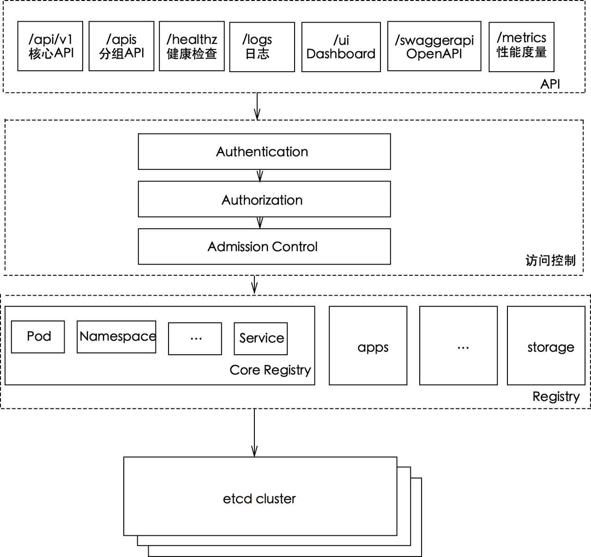

# 【k8s源码阅读】 kube-apiserver 认证 授权 准入控制

>  源码地址：git@github.com:kubernetes/kubernetes.git
> version: 1.21.3

### 简单回顾



从apiserver访问流程看，kube-apiserver作为kubernetes集群请求入口，接收客户端以及组件的请求，每一个请求都需要经过访问控制层Authentication(认证)，Authorization(授权)、Admission controller(准入控制)才能真正操作kubernetes资源。

> 访问控制层官网介绍：https://kubernetes.io/zh-cn/docs/concepts/security/controlling-access/
>
> 更多值得阅读的是关于认证授权准入控制的介绍：https://kubernetes.io/zh-cn/docs/reference/access-authn-authz/authentication/


## 1. Authentication

kube-apiserver在1.21这个版本里有8种认证方式，分别是ClientCA、TokenAuth、BootstrapToken、RequestHeader、ServiceAccounts、Anonymous、WebHookAuth、OIDC。每一种认证被实例化之后成为`Authenticator`（认证器）。

每一种认证都会封装在http.Handler请求处理函数里，接收组件或者客户端的请求并进行认证。

源码中是先对认证信息进行声明以及初始化配置，之后通过config.new进行实例化认证器。

```shell
// 代码路径： cmd/kube-apiserver/app/server.go
NewAPIServerCommand
// 初始化参数，创建对应认证方式实例
--> options.NewServerRunOptions()
    --> kubeoptions.NewBuiltInAuthenticationOptions().WithAll()
        --> WithAnonymous().
		    --> WithBootstrapToken().
		    --> WithClientCert().
		    --> WithOIDC().
		    --> WithRequestHeader().
		    --> WithServiceAccounts().
		    --> WithTokenFile().
		    --> WithWebHook()
```

在CreateServerChain创建服务链时，CreateKubeAPIServerConfig里会封装每一个认证方式，并返回`Authenticator`认证器

```
CreateServerChain
--> CreateKubeAPIServerConfig
    --> buildGenericConfig
        --> s.Authentication.ApplyTo
            --> o.ToAuthenticationConfig()
            --> authenticatorConfig.New()
                --> union.New(authenticators...)
```

调用流程：

```
DefaultBuildHandlerChain
--> genericapifilters.WithAuthentication
    --> withAuthentication
        --> auth.AuthenticateRequest(req)
            --> AuthenticateRequest
```

代码路径：vendor/k8s.io/apiserver/pkg/authentication/request/union/union.go

```go
// AuthenticateRequest authenticates the request using a chain of authenticator.Request objects.
func (authHandler *unionAuthRequestHandler) AuthenticateRequest(req *http.Request) (*authenticator.Response, bool, error) {
	var errlist []error
  // 遍历所有支持的的认证器
	for _, currAuthRequestHandler := range authHandler.Handlers {
		resp, ok, err := currAuthRequestHandler.AuthenticateRequest(req)
		if err != nil {
			if authHandler.FailOnError {
				return resp, ok, err
			}
			errlist = append(errlist, err)
			continue
		}
    
    // 有一个认证通过，即可返回。认证成功
		if ok {
			return resp, ok, err
		}
	}

	return nil, false, utilerrors.NewAggregate(errlist)
}
```

认证配置

代码路径： pkg/kubeapiserver/authenticator/config.go

主要包含认证信息配置以及构建认证器方法

```go
// Config contains the data on how to authenticate a request to the Kube API Server
// 认证请求配置信息
// 这里省略里一些配置
type Config struct {
	Anonymous      bool
	BootstrapToken bool

	TokenAuthFile               string
	OIDCIssuerURL               string
  ...
	ServiceAccountKeyFiles      []string
  ...
	APIAudiences                authenticator.Audiences
	WebhookTokenAuthnConfigFile string
	WebhookTokenAuthnVersion    string
	WebhookTokenAuthnCacheTTL   time.Duration
	// WebhookRetryBackoff specifies the backoff parameters for the authentication webhook retry logic.
	// This allows us to configure the sleep time at each iteration and the maximum number of retries allowed
	// before we fail the webhook call in order to limit the fan out that ensues when the system is degraded.
	WebhookRetryBackoff *wait.Backoff

	TokenSuccessCacheTTL time.Duration
	TokenFailureCacheTTL time.Duration

	RequestHeaderConfig *authenticatorfactory.RequestHeaderConfig

	// TODO, this is the only non-serializable part of the entire config.  Factor it out into a clientconfig
	ServiceAccountTokenGetter   serviceaccount.ServiceAccountTokenGetter
	BootstrapTokenAuthenticator authenticator.Token
	// ClientCAContentProvider are the options for verifying incoming connections using mTLS and directly assigning to users.
	// Generally this is the CA bundle file used to authenticate client certificates
	// If this value is nil, then mutual TLS is disabled.
	ClientCAContentProvider dynamiccertificates.CAContentProvider
	// Optional field, custom dial function used to connect to webhook
	CustomDial utilnet.DialFunc
}
```

返回认证器集合

```go
// New returns an authenticator.Request or an error that supports the standard
// Kubernetes authentication mechanisms.
// 认证器集合
func (config Config) New() (authenticator.Request, *spec.SecurityDefinitions, error) {
	var authenticators []authenticator.Request
	var tokenAuthenticators []authenticator.Token
	securityDefinitions := spec.SecurityDefinitions{}

	// front-proxy, BasicAuth methods, local first, then remote
	// Add the front proxy authenticator if requested
	if config.RequestHeaderConfig != nil {
		requestHeaderAuthenticator := headerrequest.NewDynamicVerifyOptionsSecure(
			config.RequestHeaderConfig.CAContentProvider.VerifyOptions,
      ...
		)
		authenticators = append(authenticators, authenticator.WrapAudienceAgnosticRequest(config.APIAudiences, requestHeaderAuthenticator))
	}

	// X509 methods
	if config.ClientCAContentProvider != nil {
		certAuth := x509.NewDynamic(config.ClientCAContentProvider.VerifyOptions, x509.CommonNameUserConversion)
		authenticators = append(authenticators, certAuth)
	}

	// Bearer token methods, local first, then remote
	if len(config.TokenAuthFile) > 0 {
		tokenAuth, err := newAuthenticatorFromTokenFile(config.TokenAuthFile)
		if err != nil {
			return nil, nil, err
		}
		tokenAuthenticators = append(tokenAuthenticators, authenticator.WrapAudienceAgnosticToken(config.APIAudiences, tokenAuth))
	}
	if len(config.ServiceAccountKeyFiles) > 0 {
		serviceAccountAuth, err := newLegacyServiceAccountAuthenticator(config.ServiceAccountKeyFiles, config.ServiceAccountLookup, config.APIAudiences, config.ServiceAccountTokenGetter)
		if err != nil {
			return nil, nil, err
		}
		tokenAuthenticators = append(tokenAuthenticators, serviceAccountAuth)
	}
	if config.ServiceAccountIssuer != "" {
		serviceAccountAuth, err := newServiceAccountAuthenticator(config.ServiceAccountIssuer, config.ServiceAccountKeyFiles, config.APIAudiences, config.ServiceAccountTokenGetter)
		if err != nil {
			return nil, nil, err
		}
		tokenAuthenticators = append(tokenAuthenticators, serviceAccountAuth)
	}
	if config.BootstrapToken {
		if config.BootstrapTokenAuthenticator != nil {
			// TODO: This can sometimes be nil because of
			tokenAuthenticators = append(tokenAuthenticators, authenticator.WrapAudienceAgnosticToken(config.APIAudiences, config.BootstrapTokenAuthenticator))
		}
	}
	// NOTE(ericchiang): Keep the OpenID Connect after Service Accounts.
	//
	// Because both plugins verify JWTs whichever comes first in the union experiences
	// cache misses for all requests using the other. While the service account plugin
	// simply returns an error, the OpenID Connect plugin may query the provider to
	// update the keys, causing performance hits.
	if len(config.OIDCIssuerURL) > 0 && len(config.OIDCClientID) > 0 {
		oidcAuth, err := newAuthenticatorFromOIDCIssuerURL(oidc.Options{
			IssuerURL:            config.OIDCIssuerURL,
			ClientID:             config.OIDCClientID,
      ...
		})
		if err != nil {
			return nil, nil, err
		}
		tokenAuthenticators = append(tokenAuthenticators, authenticator.WrapAudienceAgnosticToken(config.APIAudiences, oidcAuth))
	}
	if len(config.WebhookTokenAuthnConfigFile) > 0 {
		webhookTokenAuth, err := newWebhookTokenAuthenticator(config)
		if err != nil {
			return nil, nil, err
		}

		tokenAuthenticators = append(tokenAuthenticators, webhookTokenAuth)
	}

	if len(tokenAuthenticators) > 0 {
		// Union the token authenticators
		tokenAuth := tokenunion.New(tokenAuthenticators...)
    ...
	}

	if len(authenticators) == 0 {
		if config.Anonymous {
			return anonymous.NewAuthenticator(), &securityDefinitions, nil
		}
		return nil, &securityDefinitions, nil
	}

	authenticator := union.New(authenticators...)
	authenticator = group.NewAuthenticatedGroupAdder(authenticator)
	if config.Anonymous {
		// If the authenticator chain returns an error, return an error (don't consider a bad bearer token
		// or invalid username/password combination anonymous).
		authenticator = union.NewFailOnError(authenticator, anonymous.NewAuthenticator())
	}
	return authenticator, &securityDefinitions, nil
}
```

代码路径：vendor/k8s.io/apiserver/pkg/authentication/authenticator/interfaces.go

认证器要实现的接口

```go
// Token checks a string value against a backing authentication store and
// returns a Response or an error if the token could not be checked.
type Token interface {
	AuthenticateToken(ctx context.Context, token string) (*Response, bool, error)
}

// Request attempts to extract authentication information from a request and
// returns a Response or an error if the request could not be checked.
type Request interface {
	AuthenticateRequest(req *http.Request) (*Response, bool, error)
}

// Response is the struct returned by authenticator interfaces upon successful
// authentication. It contains information about whether the authenticator
// authenticated the request, information about the context of the
// authentication, and information about the authenticated user.
type Response struct {
	// Audiences is the set of audiences the authenticator was able to validate
	// the token against. If the authenticator is not audience aware, this field
	// will be empty.
	Audiences Audiences
	// User is the UserInfo associated with the authentication context.
	User user.Info
}
```

代码路径：pkg/kubeapiserver/options/authentication.go

```go
// BuiltInAuthenticationOptions contains all build-in authentication options for API Server
type BuiltInAuthenticationOptions struct {
	APIAudiences    []string
	Anonymous       *AnonymousAuthenticationOptions
	BootstrapToken  *BootstrapTokenAuthenticationOptions
	ClientCert      *genericoptions.ClientCertAuthenticationOptions
	OIDC            *OIDCAuthenticationOptions
	RequestHeader   *genericoptions.RequestHeaderAuthenticationOptions
	ServiceAccounts *ServiceAccountAuthenticationOptions
	TokenFile       *TokenFileAuthenticationOptions
	WebHook         *WebHookAuthenticationOptions

	TokenSuccessCacheTTL time.Duration
	TokenFailureCacheTTL time.Duration
}
```

bearer token认证流程：

```go
func (a *Authenticator) AuthenticateRequest(req *http.Request) (*authenticator.Response, bool, error) {
	auth := strings.TrimSpace(req.Header.Get("Authorization"))
	if auth == "" {
		return nil, false, nil
	}
	parts := strings.SplitN(auth, " ", 3)
	if len(parts) < 2 || strings.ToLower(parts[0]) != "bearer" {
		return nil, false, nil
	}

	token := parts[1]

	// Empty bearer tokens aren't valid
	if len(token) == 0 {
		return nil, false, nil
	}

	resp, ok, err := a.auth.AuthenticateToken(req.Context(), token)
	// if we authenticated successfully, go ahead and remove the bearer token so that no one
	// is ever tempted to use it inside of the API server
	if ok {
		req.Header.Del("Authorization")
	}

	// If the token authenticator didn't error, provide a default error
	if !ok && err == nil {
		err = invalidToken
	}

	return resp, ok, err
}
```

## 2. Authorization

在k8s系统组件以及客户端在通过认证阶段之后，会来到授权阶段。kube-apiserve同时支持多种授权机制，并且同时开启多个授权功能。

同样客户端发起一个请求，在经过授权阶段时，只要有一个授权器通过授权，则表示通过授权。

目前kube-apiserver提供了六种授权机制，分别是AlwaysAllow、AlwaysDeny、WebHook、Node、ABAC、RBAC。每一种授权机制在被实例化之后会成为一个`Authorizer`授权器，每一个授权器都封装在http.Handler里，接受请求并进行授权。

```
// 代码路径： cmd/kube-apiserver/app/server.go
--> NewAPIServerCommand
    --> options.NewServerRunOptions()
            // 实例化授权参数
        --> kubeoptions.NewBuiltInAuthorizationOptions()
```

在CreateServerChain创建服务链时，CreateKubeAPIServerConfig里会封装每一个认证方式，并返回`Authorizer`认证器

```
CreateServerChain
--> CreateKubeAPIServerConfig
    --> buildGenericConfig
        --> BuildAuthorizer
            --> s.Authorization.ToAuthorizationConfig
            --> authorizationConfig.New()
                --> union.New(authenticators...)
```

调用流程：

```
DefaultBuildHandlerChain
--> genericapifilters.WithAuthorization
    --> withAuthentication
        --> a.Authorize(ctx, attributes)
            --> Authorize
```

代码路径： vendor/k8s.io/apiserver/pkg/authorization/union/union.go

```go
// Authorizes against a chain of authorizer.Authorizer objects and returns nil if successful and returns error if unsuccessful
func (authzHandler unionAuthzHandler) Authorize(ctx context.Context, a authorizer.Attributes) (authorizer.Decision, string, error) {
	var (
		errlist    []error
		reasonlist []string
	)
  // 遍历授权器
	for _, currAuthzHandler := range authzHandler {
		decision, reason, err := currAuthzHandler.Authorize(ctx, a)

		if err != nil {
			errlist = append(errlist, err)
		}
		if len(reason) != 0 {
			reasonlist = append(reasonlist, reason)
		}
		switch decision {
    // 通过授权返回
		case authorizer.DecisionAllow, authorizer.DecisionDeny:
			return decision, reason, err
		case authorizer.DecisionNoOpinion:
			// continue to the next authorizer
		}
	}
  
	return authorizer.DecisionNoOpinion, strings.Join(reasonlist, "\n"), utilerrors.NewAggregate(errlist)
}
```

代码路径：pkg/kubeapiserver/authorizer/config.go

```go
// Config contains the data on how to authorize a request to the Kube API Server
type Config struct {
	AuthorizationModes []string

	// Options for ModeABAC

	// Path to an ABAC policy file.
	PolicyFile string

	// Options for ModeWebhook

	// Kubeconfig file for Webhook authorization plugin.
	WebhookConfigFile string
	// API version of subject access reviews to send to the webhook (e.g. "v1", "v1beta1")
	WebhookVersion string
	// TTL for caching of authorized responses from the webhook server.
	WebhookCacheAuthorizedTTL time.Duration
	// TTL for caching of unauthorized responses from the webhook server.
	WebhookCacheUnauthorizedTTL time.Duration
	// WebhookRetryBackoff specifies the backoff parameters for the authorization webhook retry logic.
	// This allows us to configure the sleep time at each iteration and the maximum number of retries allowed
	// before we fail the webhook call in order to limit the fan out that ensues when the system is degraded.
	WebhookRetryBackoff *wait.Backoff

	VersionedInformerFactory versionedinformers.SharedInformerFactory

	// Optional field, custom dial function used to connect to webhook
	CustomDial utilnet.DialFunc
}
```

```go
// New returns the right sort of union of multiple authorizer.Authorizer objects
// based on the authorizationMode or an error.
// 返回授权器集合
func (config Config) New() (authorizer.Authorizer, authorizer.RuleResolver, error) {
	if len(config.AuthorizationModes) == 0 {
		return nil, nil, fmt.Errorf("at least one authorization mode must be passed")
	}

	var (
		authorizers   []authorizer.Authorizer
		ruleResolvers []authorizer.RuleResolver
	)

	for _, authorizationMode := range config.AuthorizationModes {
		// Keep cases in sync with constant list in k8s.io/kubernetes/pkg/kubeapiserver/authorizer/modes/modes.go.
		switch authorizationMode {
		case modes.ModeNode:
			node.RegisterMetrics()
			graph := node.NewGraph()
			node.AddGraphEventHandlers(
				graph,
				config.VersionedInformerFactory.Core().V1().Nodes(),
				config.VersionedInformerFactory.Core().V1().Pods(),
				config.VersionedInformerFactory.Core().V1().PersistentVolumes(),
				config.VersionedInformerFactory.Storage().V1().VolumeAttachments(),
			)
			nodeAuthorizer := node.NewAuthorizer(graph, nodeidentifier.NewDefaultNodeIdentifier(), bootstrappolicy.NodeRules())
			authorizers = append(authorizers, nodeAuthorizer)
			ruleResolvers = append(ruleResolvers, nodeAuthorizer)

		case modes.ModeAlwaysAllow:
			alwaysAllowAuthorizer := authorizerfactory.NewAlwaysAllowAuthorizer()
			authorizers = append(authorizers, alwaysAllowAuthorizer)
			ruleResolvers = append(ruleResolvers, alwaysAllowAuthorizer)
		case modes.ModeAlwaysDeny:
			alwaysDenyAuthorizer := authorizerfactory.NewAlwaysDenyAuthorizer()
			authorizers = append(authorizers, alwaysDenyAuthorizer)
			ruleResolvers = append(ruleResolvers, alwaysDenyAuthorizer)
		case modes.ModeABAC:
			abacAuthorizer, err := abac.NewFromFile(config.PolicyFile)
			if err != nil {
				return nil, nil, err
			}
			authorizers = append(authorizers, abacAuthorizer)
			ruleResolvers = append(ruleResolvers, abacAuthorizer)
		case modes.ModeWebhook:
			if config.WebhookRetryBackoff == nil {
				return nil, nil, errors.New("retry backoff parameters for authorization webhook has not been specified")
			}
			webhookAuthorizer, err := webhook.New(config.WebhookConfigFile,
				config.WebhookVersion,
				config.WebhookCacheAuthorizedTTL,
				config.WebhookCacheUnauthorizedTTL,
				*config.WebhookRetryBackoff,
				config.CustomDial)
			if err != nil {
				return nil, nil, err
			}
			authorizers = append(authorizers, webhookAuthorizer)
			ruleResolvers = append(ruleResolvers, webhookAuthorizer)
		case modes.ModeRBAC:
			rbacAuthorizer := rbac.New(
				&rbac.RoleGetter{Lister: config.VersionedInformerFactory.Rbac().V1().Roles().Lister()},
				&rbac.RoleBindingLister{Lister: config.VersionedInformerFactory.Rbac().V1().RoleBindings().Lister()},
				&rbac.ClusterRoleGetter{Lister: config.VersionedInformerFactory.Rbac().V1().ClusterRoles().Lister()},
				&rbac.ClusterRoleBindingLister{Lister: config.VersionedInformerFactory.Rbac().V1().ClusterRoleBindings().Lister()},
			)
			authorizers = append(authorizers, rbacAuthorizer)
			ruleResolvers = append(ruleResolvers, rbacAuthorizer)
		default:
			return nil, nil, fmt.Errorf("unknown authorization mode %s specified", authorizationMode)
		}
	}

	return union.New(authorizers...), union.NewRuleResolvers(ruleResolvers...), nil
}
```

代码路径： vendor/k8s.io/apiserver/pkg/authorization/authorizer/interfaces.go

授权器要实现的接口

```go
// Attributes is an interface used by an Authorizer to get information about a request
// that is used to make an authorization decision.
type Attributes interface {
	// GetUser returns the user.Info object to authorize
	GetUser() user.Info

	// GetVerb returns the kube verb associated with API requests (this includes get, list, watch, create, update, patch, delete, deletecollection, and proxy),
	// or the lowercased HTTP verb associated with non-API requests (this includes get, put, post, patch, and delete)
	GetVerb() string

	// When IsReadOnly() == true, the request has no side effects, other than
	// caching, logging, and other incidentals.
	IsReadOnly() bool

	// The namespace of the object, if a request is for a REST object.
	GetNamespace() string

	// The kind of object, if a request is for a REST object.
	GetResource() string

	// GetSubresource returns the subresource being requested, if present
	GetSubresource() string

	// GetName returns the name of the object as parsed off the request.  This will not be present for all request types, but
	// will be present for: get, update, delete
	GetName() string

	// The group of the resource, if a request is for a REST object.
	GetAPIGroup() string

	// GetAPIVersion returns the version of the group requested, if a request is for a REST object.
	GetAPIVersion() string

	// IsResourceRequest returns true for requests to API resources, like /api/v1/nodes,
	// and false for non-resource endpoints like /api, /healthz
	IsResourceRequest() bool

	// GetPath returns the path of the request
	GetPath() string
}

// Authorizer makes an authorization decision based on information gained by making
// zero or more calls to methods of the Attributes interface.  It returns nil when an action is
// authorized, otherwise it returns an error.
type Authorizer interface {
	Authorize(ctx context.Context, a Attributes) (authorized Decision, reason string, err error)
}


// AttributesRecord implements Attributes interface.
type AttributesRecord struct {
	User            user.Info
	Verb            string
	Namespace       string
	APIGroup        string
	APIVersion      string
	Resource        string
	Subresource     string
	Name            string
	ResourceRequest bool
	Path            string
}
```

代码路径： pkg/kubeapiserver/authorizer/modes/modes.go

```go
const (
	// ModeAlwaysAllow is the mode to set all requests as authorized
	ModeAlwaysAllow string = "AlwaysAllow"
	// ModeAlwaysDeny is the mode to set no requests as authorized
	ModeAlwaysDeny string = "AlwaysDeny"
	// ModeABAC is the mode to use Attribute Based Access Control to authorize
	ModeABAC string = "ABAC"
	// ModeWebhook is the mode to make an external webhook call to authorize
	ModeWebhook string = "Webhook"
	// ModeRBAC is the mode to use Role Based Access Control to authorize
	ModeRBAC string = "RBAC"
	// ModeNode is an authorization mode that authorizes API requests made by kubelets.
	ModeNode string = "Node"
)
```

RBAC授权：

```go
func (r *RBACAuthorizer) Authorize(ctx context.Context, requestAttributes authorizer.Attributes) (authorizer.Decision, string, error) {
	ruleCheckingVisitor := &authorizingVisitor{requestAttributes: requestAttributes}

	r.authorizationRuleResolver.VisitRulesFor(requestAttributes.GetUser(), requestAttributes.GetNamespace(), ruleCheckingVisitor.visit)
	if ruleCheckingVisitor.allowed {
		return authorizer.DecisionAllow, ruleCheckingVisitor.reason, nil
	}

	// Build a detailed log of the denial.
	// Make the whole block conditional so we don't do a lot of string-building we won't use.
	if klog.V(5).Enabled() {
		var operation string
		if requestAttributes.IsResourceRequest() {
			b := &bytes.Buffer{}
			b.WriteString(`"`)
			b.WriteString(requestAttributes.GetVerb())
			b.WriteString(`" resource "`)
			b.WriteString(requestAttributes.GetResource())
			if len(requestAttributes.GetAPIGroup()) > 0 {
				b.WriteString(`.`)
				b.WriteString(requestAttributes.GetAPIGroup())
			}
			if len(requestAttributes.GetSubresource()) > 0 {
				b.WriteString(`/`)
				b.WriteString(requestAttributes.GetSubresource())
			}
			b.WriteString(`"`)
			if len(requestAttributes.GetName()) > 0 {
				b.WriteString(` named "`)
				b.WriteString(requestAttributes.GetName())
				b.WriteString(`"`)
			}
			operation = b.String()
		} else {
			operation = fmt.Sprintf("%q nonResourceURL %q", requestAttributes.GetVerb(), requestAttributes.GetPath())
		}

		var scope string
		if ns := requestAttributes.GetNamespace(); len(ns) > 0 {
			scope = fmt.Sprintf("in namespace %q", ns)
		} else {
			scope = "cluster-wide"
		}

		klog.Infof("RBAC: no rules authorize user %q with groups %q to %s %s", requestAttributes.GetUser().GetName(), requestAttributes.GetUser().GetGroups(), operation, scope)
	}

	reason := ""
	if len(ruleCheckingVisitor.errors) > 0 {
		reason = fmt.Sprintf("RBAC: %v", utilerrors.NewAggregate(ruleCheckingVisitor.errors))
	}
	return authorizer.DecisionNoOpinion, reason, nil
}
```


## 3. Admission controller

>  准入控制介绍：https://kubernetes.io/zh-cn/docs/reference/access-authn-authz/admission-controllers/

**准入控制配置：**

代码路径：pkg/kubeapiserver/options/admission.go（调用链就不贴了）

```go
func NewAdmissionOptions() *AdmissionOptions {
  // 初始化参数。同时也会注册lifecycle、validatingwebhook、mutatingwebhook准入插件
	options := genericoptions.NewAdmissionOptions()
	// register all admission plugins
  // 注册所有准入控制插件
	RegisterAllAdmissionPlugins(options.Plugins)
	// set RecommendedPluginOrder
  // 准入控制执行顺序
	options.RecommendedPluginOrder = AllOrderedPlugins
	// set DefaultOffPlugins
  // 关闭的准入控制列表
	options.DefaultOffPlugins = DefaultOffAdmissionPlugins()

	return &AdmissionOptions{
		GenericAdmission: options,
	}
}
```

代码路径：pkg/kubeapiserver/options/plugins.go

```go 
// RegisterAllAdmissionPlugins registers all admission plugins and
// sets the recommended plugins order.
// 默认注册的准入控制
func RegisterAllAdmissionPlugins(plugins *admission.Plugins) {
	admit.Register(plugins) // DEPRECATED as no real meaning 废弃的准入控制器
	alwayspullimages.Register(plugins)
	antiaffinity.Register(plugins)
	defaulttolerationseconds.Register(plugins)
	defaultingressclass.Register(plugins)
	denyserviceexternalips.Register(plugins)
	deny.Register(plugins) // DEPRECATED as no real meaning
	eventratelimit.Register(plugins)
	extendedresourcetoleration.Register(plugins)
	gc.Register(plugins)
	imagepolicy.Register(plugins)
	limitranger.Register(plugins)
	autoprovision.Register(plugins)
	exists.Register(plugins)
	noderestriction.Register(plugins)
	nodetaint.Register(plugins)
	label.Register(plugins) // DEPRECATED, future PVs should not rely on labels for zone topology
	podnodeselector.Register(plugins)
	podtolerationrestriction.Register(plugins)
	runtimeclass.Register(plugins)
	resourcequota.Register(plugins)
	podsecuritypolicy.Register(plugins)
	podpriority.Register(plugins)
	scdeny.Register(plugins)
	serviceaccount.Register(plugins)
	setdefault.Register(plugins)
	resize.Register(plugins)
	storageobjectinuseprotection.Register(plugins)
	certapproval.Register(plugins)
	certsigning.Register(plugins)
	certsubjectrestriction.Register(plugins)
}
```

**准入控制接口定义：**

代码路径：vendor/k8s.io/apiserver/pkg/admission/interfaces.go

```go
// Interface is an abstract, pluggable interface for Admission Control decisions.
type Interface interface {
	// Handles returns true if this admission controller can handle the given operation
	// where operation can be one of CREATE, UPDATE, DELETE, or CONNECT
	Handles(operation Operation) bool
}

type MutationInterface interface {
	Interface

	// Admit makes an admission decision based on the request attributes.
	// Context is used only for timeout/deadline/cancellation and tracing information.
	Admit(ctx context.Context, a Attributes, o ObjectInterfaces) (err error)
}

// ValidationInterface is an abstract, pluggable interface for Admission Control decisions.
type ValidationInterface interface {
	Interface

	// Validate makes an admission decision based on the request attributes.  It is NOT allowed to mutate
	// Context is used only for timeout/deadline/cancellation and tracing information.
	Validate(ctx context.Context, a Attributes, o ObjectInterfaces) (err error)
}
```

这里为准入控制定义了一个接口，Interface、Handles方法定义是处理操作，处理成功返回true。MutationInterface，ValidationInterface都组合了Interface接口。

其中

MutationInterface、Admit方法根据请求的属性做出准入决策（都是翻译了注释）。其实就是对请求资源做修改操作（个人理解）

ValidationInterface、Validate方法对请求属性做校验

所有的准入控制器需要实现MutationInterface、ValidationInterface其中一个，也可以两个都实现（两个都实现执行顺序是先修改在校验）。

还提供其他接口：

- type Attributes interface. 获取请求属性接口
- type ObjectInterfaces interface 获取对象类型接口
- privateAnnotationsGetter interface  根据属性获取注解接口

- type ConfigProvider interface 根据插件名称获取配置接口


代码路径：vendor/k8s.io/apiserver/pkg/admission/plugins.go

```go
// Factory is a function that returns an Interface for admission decisions.
// The config parameter provides an io.Reader handler to the factory in
// order to load specific configurations. If no configuration is provided
// the parameter is nil.
type Factory func(config io.Reader) (Interface, error)

type Plugins struct {
	lock     sync.Mutex
	registry map[string]Factory
}

func NewPlugins() *Plugins {
	return &Plugins{}
}
```

定义准入控制器插件集合，通过注册将所有插件存储registry

- func (ps *Plugins) NewFromPlugins

  将所有控制器集合成一个chainAdmissionHandler（是准入控制器的集合，同时实现准入控制接口）

代码路径：vendor/k8s.io/apiserver/pkg/admission/chain.go

```go
// chainAdmissionHandler is an instance of admission.NamedHandler that performs admission control using
// a chain of admission handlers
type chainAdmissionHandler []Interface

// NewChainHandler creates a new chain handler from an array of handlers. Used for testing.
func NewChainHandler(handlers ...Interface) chainAdmissionHandler {
	return chainAdmissionHandler(handlers)
}

// Admit performs an admission control check using a chain of handlers, and returns immediately on first error
func (admissionHandler chainAdmissionHandler) Admit(ctx context.Context, a Attributes, o ObjectInterfaces) error {
	for _, handler := range admissionHandler {
		if !handler.Handles(a.GetOperation()) {
			continue
		}
		if mutator, ok := handler.(MutationInterface); ok {
			err := mutator.Admit(ctx, a, o)
			if err != nil {
				return err
			}
		}
	}
	return nil
}
...
func (admissionHandler chainAdmissionHandler) Validate(
  ...
  
func (admissionHandler chainAdmissionHandler) Handles(
  ...
```

**默认准入控制器实现：**

代码路径：plugin/pkg/admission（这个目录下有所有准入控制器的实现）

plugin/pkg/admission/alwayspullimages/admission.go

>该准入控制器会修改每个新创建的 Pod，将其镜像拉取策略设置为 Always。 这在多租户集群中是有用的，这样用户就可以放心，他们的私有镜像只能被那些有凭证的人使用。 如果没有这个准入控制器，一旦镜像被拉取到节点上，任何用户的 Pod 都可以通过已了解到的镜像的名称 （假设 Pod 被调度到正确的节点上）来使用它，而不需要对镜像进行任何鉴权检查。 启用这个准入控制器之后，启动容器之前必须拉取镜像，这意味着需要有效的凭证。

```go
// PluginName indicates name of admission plugin.
const PluginName = "AlwaysPullImages"

// Register registers a plugin
func Register(plugins *admission.Plugins) {
	plugins.Register(PluginName, func(config io.Reader) (admission.Interface, error) {
		return NewAlwaysPullImages(), nil
	})
}
// AlwaysPullImages is an implementation of admission.Interface.
// It looks at all new pods and overrides each container's image pull policy to Always.
type AlwaysPullImages struct {
	*admission.Handler
}

// 定义不使用的变量 目的确保AlwaysPullImages 实现了MutationInterface，ValidationInterface接口
var _ admission.MutationInterface = &AlwaysPullImages{}
var _ admission.ValidationInterface = &AlwaysPullImages{}

// Admit makes an admission decision based on the request attributes
func (a *AlwaysPullImages) Admit(ctx context.Context, attributes admission.Attributes, o admission.ObjectInterfaces) (err error) {
	// Ignore all calls to subresources or resources other than pods.
  // 根据请求属性判断是否忽略请求，需要准入控制器根据自己需求判断是否忽略
  // shouldIgnore自定义
	if shouldIgnore(attributes) {
		return nil
	}
	pod, ok := attributes.GetObject().(*api.Pod)
	if !ok {
		return apierrors.NewBadRequest("Resource was marked with kind Pod but was unable to be converted")
	}
  //  修改ImagePullPolicy
	pods.VisitContainersWithPath(&pod.Spec, field.NewPath("spec"), func(c *api.Container, _ *field.Path) bool {
		c.ImagePullPolicy = api.PullAlways
		return true
	})

	return nil
}

// Validate makes sure that all containers are set to always pull images
// 校验确保所有容器镜像拉取策略为
func (*AlwaysPullImages) Validate(ctx context.Context, attributes admission.Attributes, o admission.ObjectInterfaces) (err error) {
	if shouldIgnore(attributes) {
		return nil
	}

	pod, ok := attributes.GetObject().(*api.Pod)
	if !ok {
		return apierrors.NewBadRequest("Resource was marked with kind Pod but was unable to be converted")
	}

	var allErrs []error
	pods.VisitContainersWithPath(&pod.Spec, field.NewPath("spec"), func(c *api.Container, p *field.Path) bool {
		if c.ImagePullPolicy != api.PullAlways {
			allErrs = append(allErrs, admission.NewForbidden(attributes,
				field.NotSupported(p.Child("imagePullPolicy"), c.ImagePullPolicy, []string{string(api.PullAlways)}),
			))
		}
		return true
	})
	if len(allErrs) > 0 {
		return utilerrors.NewAggregate(allErrs)
	}

	return nil
}

// check if it's update and it doesn't change the images referenced by the pod spec
func isUpdateWithNoNewImages(attributes admission.Attributes) bool {
	if attributes.GetOperation() != admission.Update {
		return false
	}

	pod, ok := attributes.GetObject().(*api.Pod)
	if !ok {
		klog.Warningf("Resource was marked with kind Pod but pod was unable to be converted.")
		return false
	}

	oldPod, ok := attributes.GetOldObject().(*api.Pod)
	if !ok {
		klog.Warningf("Resource was marked with kind Pod but old pod was unable to be converted.")
		return false
	}

	oldImages := sets.NewString()
	pods.VisitContainersWithPath(&oldPod.Spec, field.NewPath("spec"), func(c *api.Container, _ *field.Path) bool {
		oldImages.Insert(c.Image)
		return true
	})

	hasNewImage := false
	pods.VisitContainersWithPath(&pod.Spec, field.NewPath("spec"), func(c *api.Container, _ *field.Path) bool {
		if !oldImages.Has(c.Image) {
			hasNewImage = true
		}
		return !hasNewImage
	})
	return !hasNewImage
}

func shouldIgnore(attributes admission.Attributes) bool {
	// Ignore all calls to subresources or resources other than pods.
	if len(attributes.GetSubresource()) != 0 || attributes.GetResource().GroupResource() != api.Resource("pods") {
		return true
	}

	if isUpdateWithNoNewImages(attributes) {
		return true
	}
	return false
}

// NewAlwaysPullImages creates a new always pull images admission control handler
func NewAlwaysPullImages() *AlwaysPullImages {
	return &AlwaysPullImages{
		Handler: admission.NewHandler(admission.Create, admission.Update),
	}
}
```

### 准入控制调用：

> 举例：创建操作，准入控制的调用

```YAML
registerResourceHandlers
--> restfulCreateResource
    --> handlers.CreateResource
        --> createHandler
func createHandler(r rest.NamedCreater, scope *RequestScope, admit admission.Interface, includeName bool) http.HandlerFunc {
   return func(w http.ResponseWriter, req *http.Request) {
      // For performance tracking purposes.
      trace := utiltrace.New("Create", traceFields(req)...)
      defer trace.LogIfLong(500 * time.Millisecond)
      ...
      options := &metav1.CreateOptions{}
      ... 
      // 获取准入控制器
      admit = admission.WithAudit(admit, ae)
      audit.LogRequestObject(ae, obj, scope.Resource, scope.Subresource, scope.Serializer)
      userInfo, _ := request.UserFrom(ctx)
      trace.Step("About to store object in database")
      // 准入控制器属性
      admissionAttributes := admission.NewAttributesRecord(obj, nil, scope.Kind, namespace, name, scope.Resource, scope.Subresource, admission.Create, options, dryrun.IsDryRun(options.DryRun), userInfo)
      // 定义创建请求
      requestFunc := func() (runtime.Object, error) {
         return r.Create(
            ctx,
            name,
            obj,
            // 这里会执行校验的准入控制
            rest.AdmissionToValidateObjectFunc(admit, admissionAttributes, scope),
            options,
         )
      }
      // Dedup owner references before updating managed fields
      dedupOwnerReferencesAndAddWarning(obj, req.Context(), false)
      result, err := finishRequest(ctx, func() (runtime.Object, error) {
         if scope.FieldManager != nil {
            liveObj, err := scope.Creater.New(scope.Kind)
            if err != nil {
               return nil, fmt.Errorf("failed to create new object (Create for %v): %v", scope.Kind, err)
            }
            obj = scope.FieldManager.UpdateNoErrors(liveObj, obj, managerOrUserAgent(options.FieldManager, req.UserAgent()))
            admit = fieldmanager.NewManagedFieldsValidatingAdmissionController(admit)
         }
         // 执行修改类型的准入控制
         if mutatingAdmission, ok := admit.(admission.MutationInterface); ok && mutatingAdmission.Handles(admission.Create) {
            if err := mutatingAdmission.Admit(ctx, admissionAttributes, scope); err != nil {
               return nil, err
            }
         }
      ...
      trace.Step("Object stored in database")
      code := http.StatusCreated
      status, ok := result.(*metav1.Status)
      if ok && err == nil && status.Code == 0 {
         status.Code = int32(code)
      }
      transformResponseObject(ctx, scope, trace, req, w, code, outputMediaType, result)
   }
}
```

### 准入WebHook：

> https://kubernetes.io/zh-cn/docs/reference/access-authn-authz/extensible-admission-controllers/

> 扩展动态控制器介绍

准入控制器中有两个特殊的控制器：

- MutatingAdmissionWebhook
- ValidatingAdmissionWebhook

准入 Webhook 是一种用于接收准入请求并对其进行处理的 HTTP 回调机制

代码路径：vendor/k8s.io/apiserver/pkg/admission/plugin/webhook/mutating/plugin.go

```Go
// Plugin is an implementation of admission.Interface.
// MutatingAdmissionWebhook 插件定义，ValidatingAdmissionWebhook相同
type Plugin struct {
   *generic.Webhook
}
var _ admission.MutationInterface = &Plugin{}
// NewMutatingWebhook returns a generic admission webhook plugin.
// 初始化
func NewMutatingWebhook(configFile io.Reader) (*Plugin, error) {
   handler := admission.NewHandler(admission.Connect, admission.Create, admission.Delete, admission.Update)
   p := &Plugin{}
   var err error
   p.Webhook, err = generic.NewWebhook(handler, configFile, configuration.NewMutatingWebhookConfigurationManager, newMutatingDispatcher(p))
   if err != nil {
      return nil, err
   }
   return p, nil
}

// ValidateInitialization implements the InitializationValidator interface.
// 插件参数校验，与准入控制的校验不同。这里是检查相关组件是否就绪
func (a *Plugin) ValidateInitialization() error {
   if err := a.Webhook.ValidateInitialization(); err != nil {
      return err
   }
   return nil
}
// Admit makes an admission decision based on the request attributes.
// 变更实现
func (a *Plugin) Admit(ctx context.Context, attr admission.Attributes, o admission.ObjectInterfaces) error {
   return a.Webhook.Dispatch(ctx, attr, o)
}
```

准入Webhook共同的属性`generic.Webhook`

代码路径：k8s.io/apiserver/pkg/admission/plugin/webhook/generic/webhook.go

```SQL
// Webhook is an abstract admission plugin with all the infrastructure to define Admit or Validate on-top.
type Webhook struct {
   *admission.Handler
   sourceFactory sourceFactory
   hookSource       Source
   clientManager    *webhookutil.ClientManager
   namespaceMatcher *namespace.Matcher
   objectMatcher    *object.Matcher
   dispatcher       Dispatcher
}
...
...
// Dispatch is called by the downstream Validate or Admit methods.
// 当执行Validate or Admit方法时都会调用这个webhook Dispatch
func (a *Webhook) Dispatch(ctx context.Context, attr admission.Attributes, o admission.ObjectInterfaces) error {
   // 判断请求是否为WebhookConfiguration类型
   if rules.IsWebhookConfigurationResource(attr) {
      return nil
   }
   // 判断是否就绪
   if !a.WaitForReady() {
      return admission.NewForbidden(attr, fmt.Errorf("not yet ready to handle request"))
   }
   // 动态加载hooks
   hooks := a.hookSource.Webhooks()
   // 分发请求
   return a.dispatcher.Dispatch(ctx, attr, o, hooks)
}
```

Dispatcher: 将请求分发给所有加载的webhooks。返回非空则是拒绝请求

```Go
// Dispatcher dispatches webhook call to a list of webhooks with admission attributes as argument.
type Dispatcher interface {
   // Dispatch a request to the webhooks. Dispatcher may choose not to
   // call a hook, either because the rules of the hook does not match, or
   // the namespaceSelector or the objectSelector of the hook does not
   // match. A non-nil error means the request is rejected.
   Dispatch(ctx context.Context, a admission.Attributes, o admission.ObjectInterfaces, hooks []webhook.WebhookAccessor) error
}
```

代码路径： k8s.io/apiserver/pkg/admission/plugin/webhook/mutating/dispatcher.go

```Go
// 分发webhooks实现
func (a *mutatingDispatcher) Dispatch(ctx context.Context, attr admission.Attributes, o admission.ObjectInterfaces, hooks []webhook.WebhookAccessor) error {
   reinvokeCtx := attr.GetReinvocationContext()
   // 遍历还在到的相关webhooks
   for i, hook := range hooks {
      attrForCheck := attr
      if versionedAttr != nil {
         attrForCheck = versionedAttr
      }
      // 调用插件的ShouldCallHook方法,根据规则，namesapce，策略
      // 判断是否调用webhook
      invocation, statusErr := a.plugin.ShouldCallHook(hook, attrForCheck, o)
      if statusErr != nil {
         return statusErr
      }
      if invocation == nil {
         continue
      }
      // 返回对应的webhook struct
      hook, ok := invocation.Webhook.GetMutatingWebhook()
      if !ok {
         return fmt.Errorf("mutating webhook dispatch requires v1.MutatingWebhook, but got %T", hook)
      }
      ...
      t := time.Now()
      ...
      // 开始调用 返回是否已经完成修改以及err信息
      changed, err := a.callAttrMutatingHook(ctx, hook, invocation, versionedAttr, o, round, i)
      // 处理changed, err
      ignoreClientCallFailures := hook.FailurePolicy != nil && *hook.FailurePolicy == admissionregistrationv1.Ignore
      rejected := false
      if err != nil {
         switch err := err.(type) {
         case *webhookutil.ErrCallingWebhook:
            if !ignoreClientCallFailures {
               rejected = true
               admissionmetrics.Metrics.ObserveWebhookRejection(ctx, hook.Name, "admit", string(versionedAttr.Attributes.GetOperation()), admissionmetrics.WebhookRejectionCallingWebhookError, 0)
            }
         case *webhookutil.ErrWebhookRejection:
          ...
         default:
          ...
         }
      }
      admissionmetrics.Metrics.ObserveWebhook(ctx, time.Since(t), rejected, versionedAttr.Attributes, "admit", hook.Name)
   ...
   return nil
}
```

callAttrMutatingHook：发起请求

```Go
func (a *mutatingDispatcher) callAttrMutatingHook(ctx context.Context, h *admissionregistrationv1.MutatingWebhook, invocation *generic.WebhookInvocation, attr *generic.VersionedAttributes, o admission.ObjectInterfaces, round, idx int) (bool, error) {
   // 
   configurationName := invocation.Webhook.GetConfigurationName()
   annotator := newWebhookAnnotator(attr, round, idx, h.Name, configurationName)
   changed := false
   defer func() { annotator.addMutationAnnotation(changed) }()
   ...
   // 获取请求参数request，以及response初始化，作为请求后存储response
   uid, request, response, err := webhookrequest.CreateAdmissionObjects(attr, invocation)
   // Make the webhook request
   // http client
   client, err := invocation.Webhook.GetRESTClient(a.cm)
   if err != nil {
      return false, &webhookutil.ErrCallingWebhook{WebhookName: h.Name, Reason: err}
   }
   // if the webhook has a specific timeout, wrap the context to apply it
   // 判断请求是否超时
   if h.TimeoutSeconds != nil {
      var cancel context.CancelFunc
      ctx, cancel = context.WithTimeout(ctx, time.Duration(*h.TimeoutSeconds)*time.Second)
      defer cancel()
   }
   // 制作http请求
   r := client.Post().Body(request)
...
   // 发起请求，并将响应注入response
   if err := r.Do(ctx).Into(response); err != nil {
      return false, &webhookutil.ErrCallingWebhook{WebhookName: h.Name, Reason: err}
   }
   trace.Step("Request completed")
   ...
   ...
   return changed, nil
}
```


