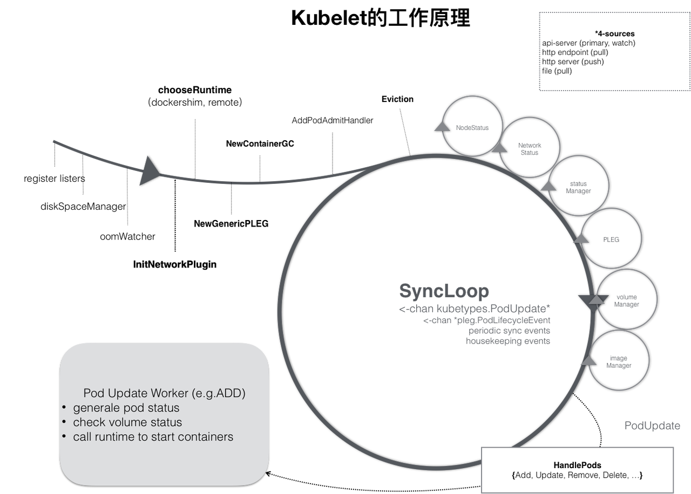

# 【k8s源码阅读】 kubelet  pod manager

Kubelet volumeManager流程分析

kubelet架构：



kubelet包含很多模块，本篇文章介绍

**volumeManager**

- kubelet调用VolumeManager，为pods准备存储设备，存储设备就绪会挂载存储设备到pod所在的节点上，并在容器启动的时候挂载在容器指定的目录中；同时，删除卸载不在使用的存储；

## **核心数据结构：**

代码路径： pkg/kubelet/volumemanager/volume_manager.go

### **VolumeManager interface：**

- 管理某一个k8s节点上所有pod的volume的mounted/unmounted（可选attached/detached）操作。通过异步循环不断监听pod卷的期望状态与实际状态进行调谐
- 当pod调度到该节点，该节点上pod manager将pod存入缓存。VolumeManager循环执行，从缓存中获取pod信息，根据pod volume进行操作
- 如果包含PV/PVC的状态，会进一步分析出具体的attach/detach、mount/umount, 操作然后调用plugin进行相应的业务处理

```SQL
// VolumeManager runs a set of asynchronous loops that figure out which volumes
// need to be attached/mounted/unmounted/detached based on the pods scheduled on
// this node and makes it so.
type VolumeManager interface {
   // Starts the volume manager and all the asynchronous loops that it controls
   // 运行VolumeManager，通过异步循环控制，循环更新期望状态，循环调谐期望状态与实际状态
   Run(sourcesReady config.SourcesReady, stopCh <-chan struct{})
   // WaitForAttachAndMount processes the volumes referenced in the specified
   // pod and blocks until they are all attached and mounted (reflected in
   // actual state of the world).
   // An error is returned if all volumes are not attached and mounted within
   // the duration defined in podAttachAndMountTimeout.
   // 处理pod中指定的volumes，直到所有的volumes都完成attached and mounted。并更新到
   // 实际状态中。如果在规定时间内没有返回，则超时返回（报错也会返回）
   WaitForAttachAndMount(pod *v1.Pod) error
   // GetMountedVolumesForPod returns a VolumeMap containing the volumes
   // referenced by the specified pod that are successfully attached and
   // mounted. The key in the map is the OuterVolumeSpecName (i.e.
   // pod.Spec.Volumes[x].Name). It returns an empty VolumeMap if pod has no
   // volumes.
   // 返回已经完成attached and mounted的卷信息
   GetMountedVolumesForPod(podName types.UniquePodName) container.VolumeMap

   // GetExtraSupplementalGroupsForPod returns a list of the extra
   // supplemental groups for the Pod. These extra supplemental groups come
   // from annotations on persistent volumes that the pod depends on.
   // 返回pod额外的信息，来自pv annotations
   GetExtraSupplementalGroupsForPod(pod *v1.Pod) []int64

   // GetVolumesInUse returns a list of all volumes that implement the volume.Attacher
   // interface and are currently in use according to the actual and desired
   // state of the world caches. A volume is considered "in use" as soon as it
   // is added to the desired state of world, indicating it *should* be
   // attached to this node and remains "in use" until it is removed from both
   // the desired state of the world and the actual state of the world, or it
   // has been unmounted (as indicated in actual state of world).
   // 获取所有实现Attacher interface接口的volumes
   // 这个其实csidriver开启了需要attach才会有作用
   GetVolumesInUse() []v1.UniqueVolumeName
   // ReconcilerStatesHasBeenSynced returns true only after the actual states in reconciler
   // has been synced at least once after kubelet starts so that it is safe to update mounted
   // volume list retrieved from actual state.
   // 安全的更新从实际状态中返回的列表
   ReconcilerStatesHasBeenSynced() bool

   // VolumeIsAttached returns true if the given volume is attached to this
   // node.
   // 如果volume已经attach,返回true
   // node yaml文件中有记录，可以看已经attach的volume
   // 这个其实csidriver开启了需要attach才会有作用
   VolumeIsAttached(volumeName v1.UniqueVolumeName) bool
  
   // Marks the specified volume as having successfully been reported as "in
   // use" in the nodes's volume status.
   // 在node里标记在使用的volume
   // 这个其实csidriver开启了需要attach才会有作用
   MarkVolumesAsReportedInUse(volumesReportedAsInUse []v1.UniqueVolumeName)
}
```

### **volumeManager struct：**

```Rust
// volumeManager implements the VolumeManager interface
// 实现VolumeManager接口的volumeManager结构体
type volumeManager struct {
   // kubeClient is the kube API client used by DesiredStateOfWorldPopulator to
   // communicate with the API server to fetch PV and PVC objects
   // DesiredStateOfWorldPopulator 使用的客户端，可以获取PV and PVC
   kubeClient clientset.Interface
  
   // volumePluginMgr is the volume plugin manager used to access volume
   // plugins. It must be pre-initialized.
   // 插件管理者 访问卷插件，必须提前初始化
   volumePluginMgr *volume.VolumePluginMgr

   // desiredStateOfWorld is a data structure containing the desired state of
   // the world according to the volume manager: i.e. what volumes should be
   // attached and which pods are referencing the volumes).
   // The data structure is populated by the desired state of the world
   // populator using the kubelet pod manager.
   // desiredStateOfWorld 卷管理的期望状态数据结构（翻译过来总感觉挺别扭，尽量保持英文原汁原味）中文做必要的作用说明
   // 记录哪些卷需要attached、哪些卷需要被pod引用
   // 通过kubelet pod manager填充期望状态
   desiredStateOfWorld cache.DesiredStateOfWorld

   // actualStateOfWorld is a data structure containing the actual state of
   // the world according to the manager: i.e. which volumes are attached to
   // this node and what pods the volumes are mounted to.
   // The data structure is populated upon successful completion of attach,
   // detach, mount, and unmount actions triggered by the reconciler.
   // actualStateOfWorld volumeManager的实际状态
   // 记录哪些卷已经attached到节点上，哪些pod的卷已经被挂载了
   // 通过reconciler，在完成attach, detach, mount, and unmount动作时会填充实际状态
   actualStateOfWorld cache.ActualStateOfWorld

   // operationExecutor is used to start asynchronous attach, detach, mount,
   // and unmount operations.
   // 操作执行器，异步执行attach, detach, mount and unmount 操作
   operationExecutor operationexecutor.OperationExecutor

   // reconciler runs an asynchronous periodic loop to reconcile the
   // desiredStateOfWorld with the actualStateOfWorld by triggering attach,
   // detach, mount, and unmount operations using the operationExecutor.
   // reconciler 通过operationExecutor触发attach, detach, mount, and unmount操作
   // 异步周期性调谐期望状态与实际状态
   reconciler reconciler.Reconciler

   // desiredStateOfWorldPopulator runs an asynchronous periodic loop to
   // populate the desiredStateOfWorld using the kubelet PodManager.
   // 使用the kubelet PodManager异步周期性填充desiredStateOfWorld
   desiredStateOfWorldPopulator populator.DesiredStateOfWorldPopulator

   // csiMigratedPluginManager keeps track of CSI migration status of plugins
   // 追踪csi状态迁移（目前没看到具体作用是什么）
   csiMigratedPluginManager csimigration.PluginManager

   // intreeToCSITranslator translates in-tree volume specs to CSI
   // intree转换csi
   intreeToCSITranslator csimigration.InTreeToCSITranslator
}
```

同样的方法：（省略源码）

- VolumePluginMgr

```Haskell
type VolumePluginMgr struct {
   // 读写锁
   mutex                     sync.RWMutex
   // 插件的对应关系
   plugins                   map[string]VolumePlugin
   prober                    DynamicPluginProber
   probedPlugins             map[string]VolumePlugin
   loggedDeprecationWarnings sets.String
   // 接口 提供插件访问kubelet能力
   Host                      VolumeHost
}
```

- DesiredStateOfWorld 


- ActualStateOfWorld


- OperationExecutor


- Reconciler


- DesiredStateOfWorldPopulator


- PluginManager


- InTreeToCSITranslator


## **挂载流程：**


## 案例分析：